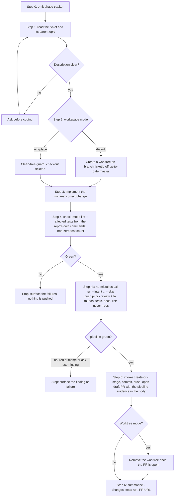

# implement-ticket - execution diagram

Implement a Jira ticket on a branch named after it and take it to an open draft PR. Kept outside per-invocation context.

```mermaid
flowchart TD
    S0["Step 0: emit phase tracker"] --> S1["Step 1: read the ticket and its parent epic"]
    S1 --> Q1{"Description clear?"}
    Q1 -->|no| ASK["Ask before coding"] --> S1
    Q1 -->|yes| S2{"Step 2: workspace mode"}
    S2 -->|default| WT["Create a worktree on branch ticketId off up-to-date master"]
    S2 -->|"--in-place"| IP["Clean-tree guard, checkout ticketId"]
    WT --> S3["Step 3: implement the minimal correct change"]
    IP --> S3
    S3 --> S4["Step 4: check-mode lint + affected tests from the repo's own commands, non-zero test count"]
    S4 --> Q4{"Green?"}
    Q4 -->|no| STOP["Stop: surface the failures, nothing is pushed"]
    Q4 -->|yes| S4B["Step 4b: no-mistakes axi run --intent ... --skip push,pr,ci - review + fix rounds, tests, docs, lint; never --yes"]
    S4B --> Q4B{pipeline green?}
    Q4B -->|no: red outcome or ask-user finding| STOP4B[Stop: surface the finding or failure]
    Q4B -->|yes| S5["Step 5: invoke create-pr - stage, commit, push, open draft PR with the pipeline evidence in the body"]
    S5 --> Q5{"Worktree mode?"}
    Q5 -->|yes| RM["Remove the worktree once the PR is open"] --> S6["Step 6: summarize - changes, tests run, PR URL"]
    Q5 -->|no| S6
```
